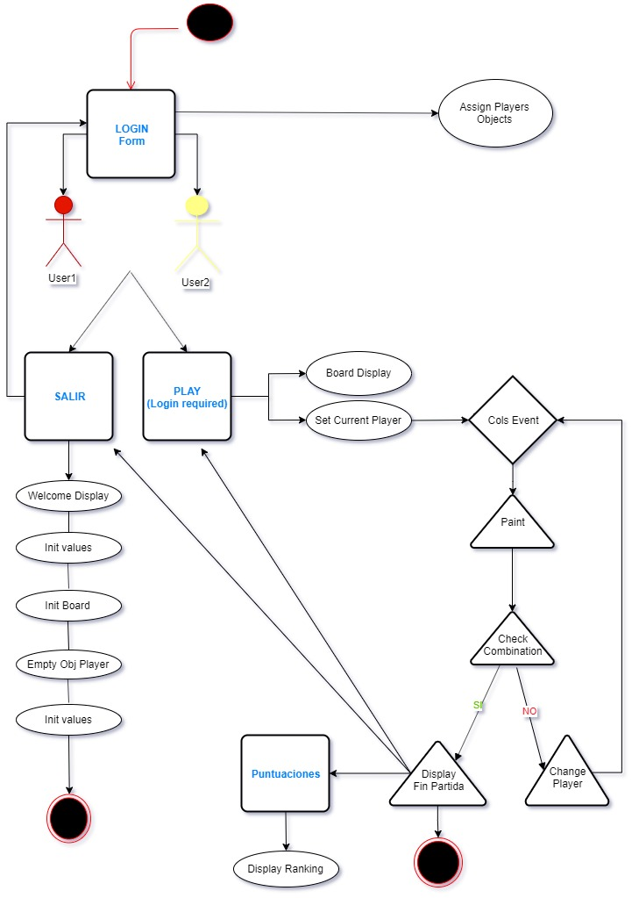

# Connect4

## Description

Connect Four is a tic-tac-toe like game in which two players drop discs into a 7x6 board. The first player to get four in a row (either vertically, horizontally, or diagonally) wins.

## Functional Description

The game is developed according to the following scheme:

## Installation

To install this project go to [Connect4](https://github.com/manoli2013/Connect4.git) and clone it to your local repository.

## Usage

The next section is usage, in which you instruct other people on how to use your project after they’ve installed it. This would also be a good place to include screenshots of your project in action.

## Credits

Include a section for credits in order to highlight and link to the authors of your project.

